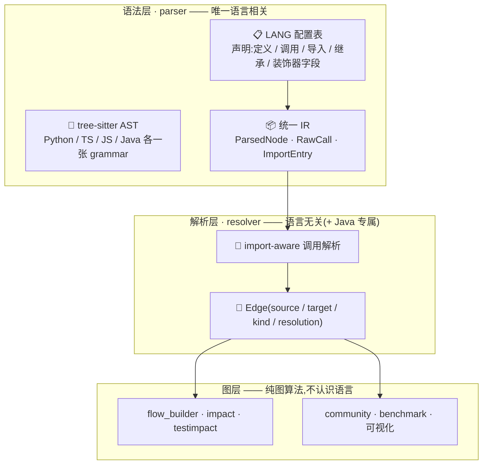
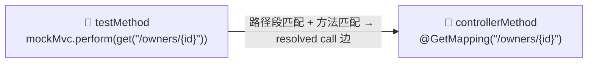
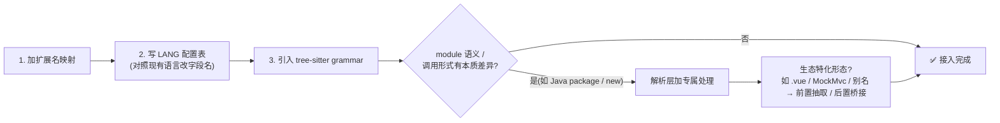

# 🌐 多语言适配总览

> 用**统一的调用图模型**解析 Python、TypeScript、JavaScript、Java 四种语言。
> 核心思想一句话:**语言差异在"语法层"被吸收成统一 IR,解析层只补少量语义,
> 再往下完全语言无关。**

| 🐍 Python | 📘 TypeScript | 🟨 JavaScript | ☕ Java |
|---|---|---|---|
| 路径 → module | 路径 → module | 路径 → module | package → module |

---

## 0. 一眼看懂:三层架构



**新增语言 = 加一张 LANG 配置 + 一个 grammar,下游零改动。**

> [!IMPORTANT]
> **区分度来自"差异落在哪一层"**:层数越浅,影响越大。
> 改动语法层 = 加一种语言;改动解析层 = 改一种语言的语义;图层永远不用动。

---

## 1. 统一模型(跨语言同一套)

### 1.1 qname —— 谁是 module?

`module::scope.scope.name` —— `::` 分隔 **module** 与第一个 **scope**,`.` 分隔嵌套 scope。

| 语言 | module 是什么 | 示例 |
|---|---|---|
| 🐍 Python | 仓库根推导的虚线路径(`src/` 剥离) | `app.service` |
| 📘 TS / 🟨 JS | 仓库根推导的虚线路径(`src/` 剥离) | `hooks.useSelectOptions` |
| ☕ Java | **package 声明**;缺失时退化路径推导 | `com.p` |

> [!NOTE]
> 剥离 `src/` 后,`src/mypkg/service.py` 与 `app/service.py` 的 module 推导规则
> 完全一致 —— 不同项目布局不改变下游语义。

### 1.2 调用形式 —— 四种形态

| 形式 | 长什么样 | 代表语言 |
|---|---|---|
| `CALL_SIMPLE` | `login()` | 全部 |
| `CALL_ATTRIBUTE` | `a.login()` / `owner.getPets()` | 全部 |
| `CALL_CONSTRUCT` | `new Foo()` | ☕ Java 专属 |
| `CALL_OTHER` | `vals[0]()` | 各语言杂项 |

### 1.3 边模型

| kind | 含义 | 进 flow? |
|---|---|---|
| `call` | 函数/方法调用 | ✅ 唯一遍历的边 |
| `contains` | 模块→函数、类→方法 | ❌ |
| `import` | 模块/符号导入(解析原料) | ❌ |
| `inherits` | extends / implements(社区检测用) | ❌ |

| resolution | 含义 |
|---|---|
| ✅ `resolved` | target 是图里**真实存在**的 qname |
| 🔸 `dynamic` | `obj.method()` 未绑定到具体类 |
| ⚠️ `unresolved` | builtin / 外部库 / `import *` / 别名未配置 |

> [!TIP]
> `dynamic` / `unresolved` 边**刻意保留**——它们让 reviewer 看得见"哪里没解析
> 出来",而不是静默消失。

---

## 2. 能力矩阵:四语言逐项对比 ⚔️

> 一表看清差异集中在哪 —— 这是全文的"速查索引",§3 是它的展开。

| 维度 | 🐍 Python | 📘 TS / 🟨 JS | ☕ Java |
|---|---|---|---|
| **module 定义** | 路径 | 路径 | package 声明 |
| **定义形态** | `class` / `def` | `function` / `class` / 方法 + **箭头赋值** | class/interface/enum/record → class;method/constructor → method |
| **调用识别** | SIMPLE / ATTRIBUTE / OTHER | SIMPLE / ATTRIBUTE / OTHER | + `new Foo()` → CONSTRUCT |
| **receiver 绑定** | —(无类型) | —(无类型) | ✅ **按声明类型绑定**(强类型红利) |
| **import** | import / from-import / **相对导入** | ESM 全形态(相对说明符解析到仓库模块) | 普通 / 通配 / **static** |
| **继承** | `superclasses` 单字段 | `extends` / `implements` | **按节点类型分字段**(interface/enum/record 各不同) |
| **装饰器/注解** | 装饰器捕获 | 装饰器捕获 | 注解(嵌套 modifiers) |
| **生态特化** | `__init__.py` 包转发追根 | tsconfig 别名 · `.vue` SFC · 箭头函数 | 类型绑定 · **Spring 映射 + MockMvc 桥接** |
| **DI 边** | 调用式 marker | 调用式 marker | 调用式 marker + **注解字段/构造器注入** |

---

## 3. 逐语言适配明细

### 🐍 Python

**基础**
- **module 推导**:路径 → 虚线;`__init__.py` 折叠为包名;`src/` 剥离。
- **定义**:`class` / `def`;嵌套成 `module::Class.method`。

**import 解析(差异最全)**

| 写法 | 绑定结果 |
|---|---|
| `import a` / `import a as b` | 模块绑定 |
| `from m import x` / `as y` | 成员绑定(含别名) |
| `from .m import y` / `from ..m import y` | **相对导入**按当前包层级换算绝对模块名 |
| `from m import *` | 通配符,不做具体成员绑定 |

**其他适配点**
- 继承:`class A(B, C)` → extends 边。
- 装饰器:`@app.route("/")`、`@click.command()` 捕获(供入口识别 / 路由语义)。
- **包转发追根**:`from .impl import Session` 经 `__init__.py` 转发时,`from pkg
  import Session` 追到 `pkg.impl::Session`,不停在包名。
- 测试识别:文件名 glob + 函数短名 glob(`test_*`)+ 装饰器 glob(`test_decorators`,
  默认 `Test`/`ParameterizedTest`,即 JUnit `@Test`)。默认文件 glob 按语言覆盖:
  Python `test_*.py`/`*_test.py`/`*/tests/*`、Java `*/test/*`/`*Test.java`/`*Tests.java`、
  TS/JS `*.test.*`/`*.spec.*`/`*/__tests__/*`。

### 📘 TypeScript / 🟨 JavaScript

> 共享同一张词法配置;差异只在模块系统与文件形态。

**定义识别**
- `function` / `class` / 方法;外加 `detect_arrow_in_vars`——**赋值给变量的箭头
  函数**(`const f = () => ...`)也是函数节点(JS 生态主流写法)。

**import 解析(ESM 全形态;相对说明符解析到仓库模块)**

相对说明符(`./auth`、`../lib/x`,含显式扩展名)在 parse 期归一为被导入模块的
qname -- 与 Python 相对导入同一策略,跨文件调用/import 边直接 resolved。Node 模块
解析的其余部分(目录 `index`、package `exports`、扩展名省略之外的形态)暂不闭合,
落空时保留原始说明符的 unresolved 边。

| 写法 | 绑定结果 |
|---|---|
| `import {a, b} from "m"` | 具名导入(含 `as` 别名) |
| `import d from "m"` | 默认导入 |
| `import * as ns from "m"` | 命名空间导入 |
| `import "m"` | 纯副作用导入 |
| `export {x} from "m"` | **转发导出** → 配合包转发追根 |

**生态特化**
- **路径别名**:`tsconfig.json` 的 `compilerOptions.paths` **自动检测**(`"@/*" →
  `src/`);显式配置/env 优先。解析时替换别名前缀,`@/hooks/x` → `hooks.x`。
  未配置时保留原始说明符的 unresolved 边(不静默消失)。
- **`.vue` SFC**:抽 `<script>` 块按 TS 解析,行号回对齐原文件;template/style
  不进图。
- 继承:`extends` / `implements`;装饰器:`@Controller`、`@Get()` 捕获。

### ☕ Java —— 差异最大,解析层唯一专属逻辑

> 三个本质差异:没有"模块文件"、依赖 package + import、**强类型**。
> 每一条对应一块专属适配。

**① module = package**
- 解析 `package` 声明作为 module;缺失时退化路径推导(`src/main/java`、
  `src/test/java` 剥离)。

**② 定义归一**
- `class` / `interface` / `enum` / `record` 统一为 class;
  `method` / `constructor` 统一为 method —— "类成员"模型跨语言一致。

**③ 强类型红利:receiver 类型绑定**

```
owner.getPets()
   │
   └─ 查 owner 的声明类型(List<Owner> 取 base → Owner)
        → 绑定到 Owner::getPets(精确解析,别的语言做不到)
```

- 预收集:类字段声明类型、方法参数与局部变量声明类型。
- `var`(Java 10 推断)与原生类型不参与绑定。
- `this.x` 剥离后按当前类解析;`Foo.Bar.create()` 按最长 module 前缀匹配 FQCN。

**④ 调用识别**
- `method_invocation`:receiver 与方法名**分字段**。
- `new Foo()` → `CALL_CONSTRUCT`,绑定类本身,并**额外补一条到 真实构造函数 `Foo::Foo.Foo`（Java 构造函数以类名命名；Python 才是 `__init__`）
  的边**。

**⑤ import(三种形态)**

| 写法 | 绑定结果 |
|---|---|
| `import a.b.C` | 普通:类绑定 |
| `import a.b.*` | 通配符 |
| `import static a.b.C.m` | **static**:成员 `m` 绑定到类 `a.b::C` |

**⑥ 继承:按节点类型分字段**
- class → `extends` + `implements`;interface → 裸 `extends`;
  enum / record → `implements`。

**⑦ Spring 生态特化**
- 收集方法级映射(`@GetMapping("/pets")`),拼接类级 `@RequestMapping` 前缀成完整路径。
- **入口识别**:Mapping 注解名进入方法 `decorators`,默认 `entry_decorators` 覆盖
  (`GetMapping`/`PostMapping`/`PutMapping`/`DeleteMapping`/`PatchMapping`/`RequestMapping`),
  被 `build_flows` 认定为 flow 入口、被 dead-code 排除 —— HTTP handler 不再当删码候选。
- **MockMvc 桥接**:`mockMvc.perform(get("/owners"))` 提取 HTTP 方法 + 路径,与
  controller 映射做**路径段匹配(支持 `{id}` 模板)**,合成
  `test_method → controller_method` 的 resolved call 边 —— 改 controller 方法,
  测它的集成测试在 flow 里可见。



### 🔌 DI 边(调用式 marker + Java 注解/构造器注入)

> 两类:调用式 marker(`Depends(get_db)`,各语言通用)与 Java 注解字段/
> 构造器注入(`@Autowired`,见下)。语法层按语言收,解析层语言无关解。

| 层 | 做什么 |
|---|---|
| 语法层 | 按语言找参数容器(Python:裸 `argument_list`;TS/JS/Java:`arguments` 字段),**原文**存入 IR |
| 解析层 | `dependency_markers`(默认 `["Depends"]`)按调用目标短名 glob 匹配 → 裸标识符 / 点路径参数走**与普通调用完全相同的解析**(局部/import/包转发/Java 类型全复用)→ 发 resolved call 边 |

**Java 注解字段 / 构造器注入**(IR: `DiDecl`,resolver 按 `di_annotations` 过滤):
- `@Autowired private OwnerRepository owners;` -- 注解命中 `di_annotations`
  (默认 `["Autowired","Inject","Resource","MockBean"]`)-> 类 -> 依赖类 的 resolved call 边;
- 构造器参数(无需注解,Spring 单构造器隐式注入;仓库内类型才发边)->
  `构造函数 -> 依赖类` 边,与 `new Foo()` 补构造函数边串联:
  `调用方 -> 构造函数 -> 构造器持有的服务`。

结果:flow / impact / 度计算 / 评测的 `call_resolutions` **自动纳入,无语言分支**。四语言一加全通。

---

## 4. 语言无关层 —— 无需适配 🎉

以下模块全吃统一 IR / 图,新增语言后**零改动**获得完整能力:

| 模块 | 能力 |
|---|---|
| `flow_builder` | 入口 BFS 展开 |
| `impact` / `testimpact` | membership 切片 + 边回退 / 反向过滤到测试节点 |
| `graph` / `changes` | 邻域查询 / git diff → 变更符号 |
| `community` | 社区检测 |
| `benchmark` / `export_graph` | 评测 / 可视化 |

---

## 5. 各语言的已知边界 ⚑

| 语言 | 识别不到的形态 | 结果 |
|---|---|---|
| 🐍 Python | 动态派发(`getattr`)、猴子补丁、`**kwargs` 间接调用 | `unresolved` / `dynamic` |
| 📘 TS / 🟨 JS | `obj.method()` 未绑定声明类型;别名未配置 | `dynamic` / `unresolved`(保留原始说明符) |
| ☕ Java | `var` 推断、运行时多态(接口方法的真实实现) | 不绑定 / `dynamic` |
| 🧩 Vue | `<template>` / `<style>` | 不进图(只解析 script) |
| 🌐 通用 | 外部库、builtin、`import *` 具体成员 | `unresolved` |

> [!WARNING]
> 这些缺口是**设计使然**,不是缺陷:边保留 + resolution 标签,让 AI reviewer
> 看到"哪里没解析出来"。

---

## 6. 新增语言的接入路径 🛠


